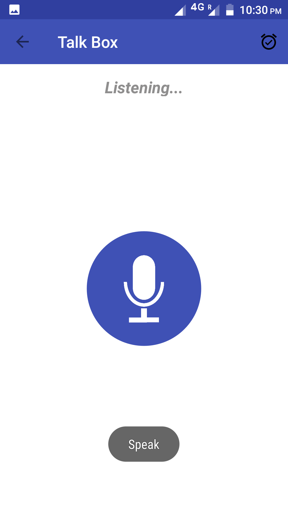
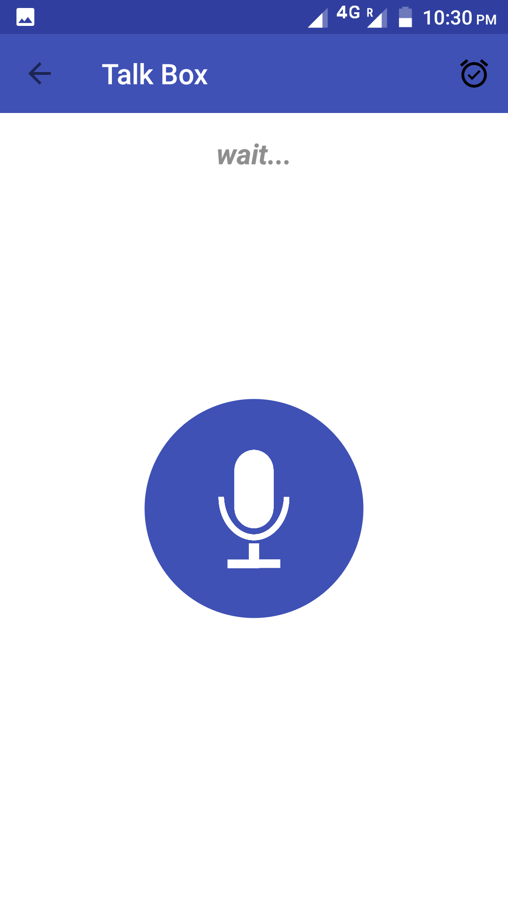
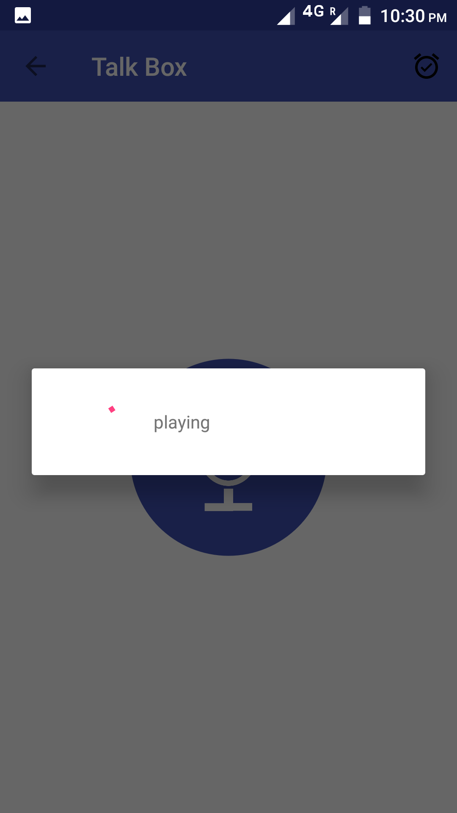

# MyOwnAlexa
*An Android application which gives you your own Artificial Personal Assistant - **ALEXA***
<p align="center">
 
</p>


## How to run the application ?

   1. Follow the process for creating a connected device detailed at this Amazon link  https://developer.amazon.com/appsandservices/solutions/alexa/alexa-voice-service/getting-started-with-the-alexa-voice-service.
   2. Also see this github link for better understanding https://github.com/alexa/alexa-avs-sample-app. **Don't forget to enable your
   security profile for Login with Amazon!**
   3. Add your **api_key.txt** file (part of the Amazon process) to the **app/src/main/assets** folder.
   4. Enter the **PRODUCT_ID** in the MainActivity.java that you configured for "Application Type Id" above.
   
   ```
   Fill in the Device type ID here or Application type ID 
   private static final String PRODUCT_ID = "DhanrajCompanionProduct"; 
   ```
    
   5. Build and run the sample app using Gradle from the command line or Android Studio!
   
## Steps from Login to Talk Box.
   1. Install the application in mobile. Press the **Login button** on the screen it will take you to your web browser
   to login in your account through your **security profile** which you set for registering your product and to get **access token** for communicating with Alexa.
   2. Now you will be directed to **Talk Box** activity where you can talk with **Alexa**. Just keep your finger down on the button and ask your 
   question and release it when you are finished.
   
   <p align="center">
  
</p>
   
## Set an alarm   
    
   You can set an alarm by asking **"Set an alarm"** and wait for the response as it is a **continuous session**. Now don't press 
   the button as Alexa will ask you the time for the alarm. After setting the alarm you can continue as before.
   
   You can delete the alarm from the list by long pressing the desired alarm.
   
***The application is completely build from the AVS Documentation.***  

## License

MyOwnAlexa is under **MIT License**.
 
